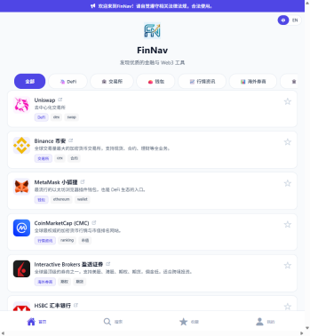
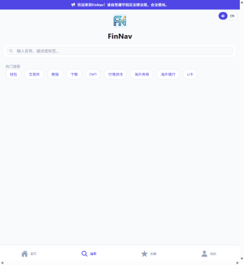
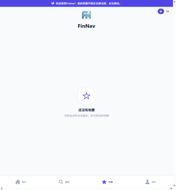
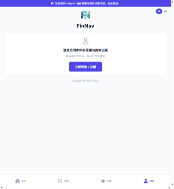

| |
|:---:|
|  |

# finnav


金融 / Web3 网站导航应用。一套前端代码打包 Web / Android / iOS，后端 Django 管理后台可自由添加分类与站点。

- 界面支持**中英文切换**：前端右上角悬浮「中 / EN」一键切换；后端 API 错误与校验消息按客户端语言返回翻译（默认中文）。
- **English**：见 [README.en.md](README.en.md)。

## 截图






## 功能

- 首页：分类筛选 + 站点卡片（logo / 名称 / 描述 / 标签），点击进入站点详情，下拉刷新
- 站点详情页：文字教程、视频教程、代办申请（如黄鱼）链接（每种可多条），APP 下载（含版本号）、访问官网
- 一键转发：详情页分享站点名称/描述/链接（原生系统分享 / Web `navigator.share`）；分享的站点链接格式由后台「转发来源域名」设置控制——配置后为「该地址/site/站点ID」（便于未装 App 的用户打开网页版），留空则为 `finnav:///site/xx` 深链接
- 打星评分：邮箱注册用户可对站点打星（最低 0 星、最高 5 星），评论可选；每个站点汇总平均星级与评分人数，一人>一票
- 访问统计：打开站点详情页计一次访问
- 搜索：按名称/描述/标签实时搜索
- 收藏：本地持久化（AsyncStorage）；登录后自动与服务器同步，支持跨设备保持一致
- 账号：邮箱验证码注册（Resend，本地无密钥时验证码打印到后端日志）、登录、忘记密码；「我的」页可退出登录；搜索历史、收藏
随账号同步保持个性化
- 界面：Ant Design (蚂蚁) 主题外观，靛蓝金融配色，深色/浅色模式跟随系统；底部 Tab、搜索、卡片、弹窗等均为 AntD 组件（子路径引用）
- 管理后台：Simpleui 主题。概览页分类统计各站点访问情况，并按「访问量 + 平均星级 + 评分数」综合排序 TOP10；自由增删改分类与站点，上传 logo 与 APP 安装包，维护教程/视频/代办链接；站点设置可配置「转发来源域名」等全局项
- Logo：支持上传 PNG / JPG / WebP / SVG，SVG 会自动转为 PNG 再保存（后端经 cairosvg 转换，失败则回退保存原文件）

## 项目结构

```
finnav/
├── backend/     # Django + DRF 后端（API + 管理后台）
├── frontend/    # Expo (React Native) 跨端前端
├── scripts/     # 开发服务与移动端打包脚本（start/stop/build_android/build_ios）
├── .github/
│   └── workflows/  # Android APK / iOS IPA 打包工作流
├── docs/
│   ├── api.md   # 前后端 API 契约
│   └── screenshots/  # 截图
├── docker/      # Docker Compose 部署（单端口对外，包含后端、前端、Nginx 反向代理）
```

## 开发服务管理（scripts/）

一键启动 / 停止 / 重启 / 查看前后端开发服务：

```bash
./scripts/dev.sh start           # 启动后端(8000) + 前端(8081)
./scripts/dev.sh start backend   # 仅后端
./scripts/dev.sh start frontend  # 仅前端
./scripts/dev.sh status          # 查看运行状态
./scripts/dev.sh restart         # 重启全部
./scripts/dev.sh stop            # 停止全部
./scripts/dev.sh stop backend    # 仅停止后端
```

- 均后台运行，日志写入 `logs/`，PID 写入 `.run/`
- 端口可用环境变量覆盖：`BACKEND_PORT`、`FRONTEND_PORT`
- 前端 API 地址默认 `http://localhost:8000`，可用 `EXPO_PUBLIC_API_BASE_URL` 覆盖
- 各子脚本也可单独调用：`./scripts/start_backend.sh`、`./scripts/stop_backend.sh`、`./scripts/start_frontend.sh`、`./scripts/stop_frontend.sh`、`./scripts/status.sh`

## 技术栈

- 前端：Expo SDK 55 (React Native 0.83) + expo-router + TanStack Query + AsyncStorage + @ant-design/react-native（Ant Design 主题）+ i18next / react-i18next / expo-localization
  - 注意：必须用子路径引入 AntD 组件（如 `@ant-design/react-native/es/button`），不可 `from "@ant-design/react-native"`——该 barrel 入口在 RNGH v3 下无法打包（依赖已移除的 `DrawerLayout`）
- 后端：Django 5.2 LTS（含 `gettext` 国际化） + Django REST Framework + djangorestframework-simplejwt + django-simpleui + django-cors-headers + Pillow + cairosvg（SVG 图标转 PNG）

## 后端（backend/）

```bash
cd backend
python3 -m venv .venv
.venv/bin/pip install -r requirements.txt
.venv/bin/python manage.py migrate
.venv/bin/python manage.py seed_demo      # 可选：插入演示分类与站点
.venv/bin/python manage.py createsuperuser  # 管理后台账号
.venv/bin/python manage.py runserver 0.0.0.0:8000
```

- API 文档/契约：`docs/api.md`；根路径 `/api/`，健康检查 `GET /api/health/`
- 管理后台：http://localhost:8000/admin/ （添加/编辑分类、站点，上传 logo）
- 配置覆盖：复制 `.env.example` 为 `.env`，可覆盖 `DEBUG` / `SECRET_KEY` / `ALLOWED_HOSTS` 及数据库选项；真实环境变量优先于 `.env`
- 数据库：默认 SQLite（零配置）。可用 `DB_ENGINE=mysql|postgres` 切换，详见 `backend/.env.example` 中的 `DB_*` 变量说明
- 测试：`.venv/bin/python manage.py test`
- 运行：`./scripts/start_backend.sh`（或 `.venv/bin/python manage.py runserver 0.0.0.0:8000`)
- **国际化**：后端 API 错误消息按 `Accept-Language` 头协商语言（zh→中文，en→英文，其它→英文）；默认中文。建模校验消息用 `_()`/`gettext_lazy()` 包裹，翻译源在 `backend/apps/navigation/locale/`；改完 `.po` 后执行 `.venv/bin/python manage.py compilemessages`。Docker 部署时 `docker/backend/entrypoint.sh` 会自动编译。

## 前端（frontend/）

```bash
cd frontend
npm install
npm run web        # Web（浏览器访问）
npm run android    # Android（expo run:android，本地原生构建）
npm run ios        # iOS（expo run:ios，本地原生构建）
```

- API 地址默认：web/iOS 用 `http://localhost:8000`，Android 模拟器用 `http://10.0.2.2:8000`；可用环境变量 `EXPO_PUBLIC_API_BASE_URL` 覆盖（如指向局域网 IP 供真机联调）
- 真机联调：后端需 `runserver 0.0.0.0:8000`，前端设置 `EXPO_PUBLIC_API_BASE_URL=http://<局域网IP>:8000`
- 运行：`./scripts/start_frontend.sh`（或 `npm run web`）
- 校验：`npx tsc --noEmit`、`npx expo export --platform web`
- 注意：`react` 与 `react-dom` 必须保持完全相同的版本（当前为 19.2.0，与 Expo SDK 55 对齐）；如需调整请用 `npx expo install react react-dom` 而非直接改 package.json

## Android / iOS 打包（本地 EAS 脚本 + GitHub Actions 发布 Release）

同一套前端代码可打出 **Android APK** 与 **iOS IPA** 安装包。项目提供两条打包路径：

1. **本地打包（EAS 云端构建）**：`scripts/build_android.sh` / `scripts/build_ios.sh` 把代码上传到 EAS 云端编译（本地无需 Android SDK / Xcode / macOS），需 Expo 账号。
2. **GitHub Actions 打包 + 发布 Release**：直接在 GitHub runner 上「Expo prebuild 生成原生工程 + Gradle / Xcode 构建」，无需 EAS；手动运行或打 `v*` 标签都会构建并发布**草稿 Release**，可配置各项参数。

### 一、本地打包（EAS 云端构建）

本地无需安装 Android SDK / JDK / Xcode，也无需 macOS 即可打 iOS 包。

#### 一次性前置（仅需一次）

```bash
npx eas-cli login                        # 登录 Expo 账号（CI 用 EXPO_TOKEN 环境变量）
cd frontend && npx eas-cli init          # 关联 EAS 项目（生成 eas.json 与 projectId）
npx eas-cli credentials                  # iOS 签名凭据（Apple 开发者账号）；Android keystore 首次构建自动生成
```

#### 配置变量

按优先级 **环境变量 > `scripts/build.env`（复制自 `scripts/build.env.example`）> 默认值**：

| 变量 | 默认值 | 说明 |
|---|---|---|
| `APP_NAME` | app.json 的 `name` | 应用显示名 |
| `APP_VERSION` | app.json 的 `version` | 版本号（如 `1.0.0`） |
| `ANDROID_PACKAGE` | `com.finnav.app` | Android applicationId |
| `ANDROID_VERSION_CODE` | 由版本号推导 | Android versionCode（如 1.0.0 → 10000） |
| `IOS_BUNDLE_IDENTIFIER` | `com.finnav.app` | iOS bundleIdentifier |
| `IOS_BUILD_NUMBER` | `1` | iOS build 号 |
| `IOS_DEPLOYMENT_TARGET` | `15.1` | iOS 最低部署版本（默认固定 15.1，SDK 55 最低；兼容 iPhone 6s Plus iOS 15.8.8 与 iPadOS 26.2） |
| `EAS_PROFILE` | `preview` | 构建 profile：`preview`=APK 直装（日常调试）/ `production`=AAB 上架 |
| `EAS_CLI` | `npx --yes eas-cli@latest` | eas-cli 调用方式（CI 可固定版本） |
| `EXPO_PUBLIC_API_BASE_URL` | 空 | **打进包的后端 API 地址** |
| `ANDROID_ALLOW_CLEARTEXT` | 空 | 设为 `1` 允许明文 HTTP（仅调试/内网后端，正式上架请用 HTTPS） |
| `EXPO_TOKEN` | 空 | CI / 无交互环境的 Expo 访问令牌（跳过 `eas-cli login`） |
| `BUILD_OUTPUT_DIR` | `frontend/build` | 产物目录 |

#### 打包

```bash
cd frontend && npm install

# Android（EAS_PROFILE=preview 出 APK 可直装；production 出 AAB 上架）
./scripts/build_android.sh
# 产物: frontend/build/android/finnav-<版本>-<EAS_PROFILE>-android.{apk,aab}

# iOS（需先在 EAS 配置签名凭据）
./scripts/build_ios.sh
# 产物: frontend/build/ios/finnav-<版本>-<EAS_PROFILE>-ios.ipa
```

`EXPO_PUBLIC_API_BASE_URL` 会在构建时临时写入 `frontend/eas.json` 对应 profile 的 `env`，云端 Metro 打包内联进 App，构建结束后自动还原文件。留空则用前端内置默认逻辑（web/真机跟随访问主机，Android 模拟器 `10.0.2.2:8000`）。

### 二、GitHub Actions 打包 + 发布 Release

仓库内置两个工作流（`.github/workflows/`），**在 runner 上直接构建，无需 EAS / Expo 账号**：

- **`build-android.yml`**：`ubuntu-latest` 上 `expo prebuild` + Gradle 构建 APK/AAB
- **`build-ios.yml`**：`macos-26`（Xcode 26.4.1）上 `expo prebuild` + `xcodebuild` 构建 IPA（默认模拟器包免签名；`iphoneos-unsigned` 真机免签名包供爱思助手自签安装）

触发方式：

- **手动**：Actions 页面 → 对应 Workflow → `Run workflow`，填写版本号、包名、后端 API 地址等参数
- **打 tag**：推送 `v*` 标签（如 `v1.0.0`），自动以标签版本号构建

每次构建成功都会**发布一个草稿 Release**（`v<版本>`，自动创建对应 tag），到 Releases 页面人工确认后即可发布。产物同时通过 `actions/upload-artifact` 上传到工作流运行页面。

#### 可配置参数（手动运行时）

以下为两个工作流的输入合并（Android 相关在 `build-android.yml`，iOS 相关在 `build-ios.yml`）：

| 参数 | 默认值 | 说明 |
|---|---|---|
| `app_version` | 空 | 版本号（留空用 app.json / 标签版本） |
| `version_code` | 由版本号推导 | Android versionCode |
| `android_package` | `com.finnav.app` | Android applicationId |
| `build_type` | `release` | Android Gradle 构建类型 release / debug |
| `artifact_type` | `apk` | Android 产物 apk（直装）/ aab（上架） |
| `build_number` | `1` | iOS build 号 |
| `ios_bundle_identifier` | `com.finnav.app` | iOS bundleIdentifier |
| `ios_sdk` | `iphonesimulator` | iOS SDK（`iphonesimulator` 模拟器包免签名 / `iphoneos-unsigned` 真机免签名包供自签 / `iphoneos` 真机自动签名包） |
| `api_base_url` | 空 | **打进包的后端 API 地址** |
| `allow_cleartext` | `false` | 是否允许明文 HTTP（仅调试/内网后端） |

#### Secrets（可选）

| Secret | 说明 |
|---|---|
| `ANDROID_KEYSTORE_BASE64` | keystore 文件的 base64 内容（配置后 release 包用正式签名） |
| `ANDROID_KEYSTORE_PASSWORD` | keystore 密码 |
| `ANDROID_KEY_ALIAS` | key 别名 |
| `ANDROID_KEY_PASSWORD` | key 密码 |
| `IOS_DEVELOPMENT_TEAM` | Apple 开发者 Team ID（iOS `iphoneos` 真机包自动签名用） |

- Android 未配置 keystore 时用 debug 签名（APK 仍可直接安装）
- iOS 默认 `iphonesimulator` 免签名（可装模拟器，不可装真机）；`iphoneos-unsigned` 真机免签名包（无签名，可用爱思助手等自签安装，无需 Apple 开发者账号）；`iphoneos` 真机自动签名包需 `IOS_DEVELOPMENT_TEAM` + 自动签名
- iOS 最低部署版本 15.1（Expo SDK 55 最低支持），一套真机包可同时安装到 iPhone 6s Plus（iOS 15.8.8）与 iPadOS 26.2
- 手动运行时若版本 tag 已存在，草稿 Release 会被更新；自动生成的 tag 会再触发一次 tag 构建（产出相同草稿），属正常行为

## 一键部署脚本（适用于主流 Linux）

FinNav 提供了 `deploy_finnav.sh` 脚本，可在 Ubuntu/Debian、CentOS/RHEL、Fedora、Arch 等常见 Linux 发行版上一键完成以下工作：

- 安装系统依赖（git、curl、编译工具、Python、Node.js 20 LTS）
- 创建专用系统用户并设置适当的文件权限
- 克隆仓库、创建 Python virtualenv、安装后端依赖
- 自动完成数据库迁移、收集静态文件、可选导入演示数据 (`seed_demo`)
- 通过 systemd 启动 Gunicorn，提供 **systemd** 管理
- 可选配置 Nginx + Let’s Encrypt HTTPS（自动获取证书）
- 自动打开防火墙所需端口

### 使用方法

```bash
# 若仓库中已存在此脚本，直接赋予执行权限
chmod +x deploy_finnav.sh
# 以 root 身份运行（交互式配置，默认导入 demo 数据）
sudo ./deploy_finnav.sh
```

### 常用参数（可在交互式提示时直接输入）

| 参数 | 说明 |
|------|------|
| `--https` | 开启 HTTPS 并自动配置 Nginx + Certbot |
| `--cert-email <email>` | Certbot 注册使用的邮箱 |
| `--db-type <sqlite|postgres|mysql>` | 选择数据库后端 |
| `--db-host <host>` | 数据库主机（非 SQLite 必填） |
| `--db-port <port>` | 数据库端口 |
| `--db-name <name>` | 数据库名称 |
| `--db-user <user>` | 数据库用户名 |
| `--db-pass <pwd>` | 数据库密码 |
| `--run-user <user>` | 运行服务的系统用户（默认 `finnav`） |
| `--install-dir <path>` | 项目安装路径（默认 `/opt/finnav`） |
| `--workers <n>` | 手动指定 Gunicorn workers（默认自动检测 `$(nproc)`） |
| `--no-demo` | 跳过 `seed_demo` 导入 |

> **提示**：脚本会在交互过程中显示每个选项的默认值，直接回车即可接受默认。

## Docker 部署教程

项目提供了基于 Docker Compose 的一键部署方案，适用于生产或快速演示环境。以下为核心步骤：

1. **准备**  
   - 确保机器已安装 Docker Engine（>= 20.10）和 Docker Compose v2。  
   - 若需要自定义端口或环境变量，请编辑 `docker/.env.example` 并将其复制为 `docker/.env`。

2. **启动**  
   ```bash
   cd docker
   cp .env.example .env   # 首次部署，按需修改（密钥、端口等）
   docker compose up -d --build
   ```

3. **访问入口**（默认端口 80，可在 `.env` 中的 `PORT` 覆盖）  

   | 入口 | 地址 |
   |------|------|
   | 前端 Web | http://localhost/ |
   | 管理后台 | http://localhost/admin/ |
   | API | http://localhost/api/ |

### 前后端分开部署

默认一体化部署；如需**前后端分别独立部署**（例如不同主机），仓库附带两个独立 compose 文件：

```bash
# 后端独立（对外端口 BACKEND_PORT，默认 8000；提供 API/管理后台/静态/媒体）
docker compose -f docker-compose.backend.yml up -d --build

# 前端独立（对外端口 PORT 默认 80；把 /api /admin /static /media 反代到远端后端）
# 需先在 docker/.env 中设置 BACKEND_URL=http://<后端IP>:8000
docker compose -f docker-compose.frontend.yml up -d --build
```

- 前端独立部署无需共享数据目录，`BACKEND_URL` 可指向任意后端（同机或远端）
- 媒体 `/media/` 由前端 nginx 反代到后端，后端在生产环境也会提供 `/media/`（缓存头保留）
- 详见 [`docker/README.md`](docker/README.md)

### 移动端 App 直连后端（仅部署后端时）

Android / iOS App 与 Web 前端无关，只调用后端 API，因此**只部署后端时 App 也能正常使用**：

```bash
# 1. 仅部署后端（对外端口 BACKEND_PORT，默认 8000）
docker compose -f docker-compose.backend.yml up -d --build
# 2. 打包 App 时指定后端地址
EXPO_PUBLIC_API_BASE_URL=http://<后端IP或域名>:8000 ./scripts/build_android.sh   # 或 build_ios.sh
```

- 需在防火墙/安全组放行 `BACKEND_PORT`；`ALLOWED_HOSTS=*` 默认接受任意 Host（生产建议改为实际域名/IP）
- 媒体已由后端在生产环境提供，API 返回的绝对媒体 URL 自动基于访问地址生成
- **iOS**：直连 HTTP 后端可用（项目已通过 `ios.infoPlist.NSAppTransportSecurity.NSAllowsArbitraryLoads` 开启明文放行，见 `frontend/app.json`）。注意：RN 0.83 模板默认只放行本地网络，若移除该配置，对**公网 IP 的明文 HTTP 会被 ATS 拦截**报 "Network request failed"，此时应改用 HTTPS 或加回 ATS 例外
- **Android**：release 包默认拦截明文 HTTP（Android 9+）。若后端为无 TLS 的 `http://IP:8000`，
  本地/内网联调可设 `ANDROID_ALLOW_CLEARTEXT=1` 重新打包；**正式上架请让后端走 HTTPS**（无需该开关）

4. **常用运维命令**  

   ```bash
   # 查看容器状态
   docker compose ps
   # 查看日志
   docker compose logs -f backend   # 后端日志（验证码等）
   docker compose logs -f frontend  # 前端日志
   # 停止并保留数据卷
   docker compose down
   # 停止并删除数据卷（彻底清理）
   docker compose down -v
   ```

5. **数据持久化**  
   - 数据库存储在 `docker/data/` 目录（SQLite 文件 `db.sqlite3` 与 `media/`）。该目录通过卷挂载在容器内，容器重启后数据仍然保留。  
   - 如需使用 MySQL/PostgreSQL，请在 `.env` 中将 `DB_ENGINE` 改为 `mysql` 或 `postgres`，并填写相应的 `DB_*` 环境变量；容器本身不提供数据库服务，需自行连接外部数据库实例。

6. **备份/恢复**（使用后端管理页面或命令行）  

   ```bash
   # 打包备份（自动生成 zip 包）
   docker compose exec backend python manage.py backup -o backup.zip
   # 恢复备份（会清空并覆盖当前数据）
   docker compose exec backend python manage.py restore backup.zip
   ```

> **提示**：若想在生产环境使用 HTTPS，请在外部 Nginx/Traefik 中为 `http://localhost` 代理实现 TLS 终端。

## 免责声明

本项目纯属个人开发研究，可能存在缺陷或不完善之处。请在使用时遵守当地法律法规，如因使用本项目代码导致的任何法律纠纷或损失，均由使用者自行承担责任。

## 捐助

如果本项目对您有帮助，欢迎通过以下方式进行捐助：
- USDT（ERC20）地址：`0xAdf7CBcF1afC6a0692aEb6a0deE13110cc65C0EF`
- USDC（ERC20）地址：`0xAdf7CBcF1afC6a0692aEb6a0deE13110cc65C0EF`

感谢您的支持与鼓励！如果您不便捐助，也欢迎提交 Issue 或 Pull Request 共同改进项目。


本项目基于 **MIT 许可证**，详见根目录 `LICENSE` 文件。

